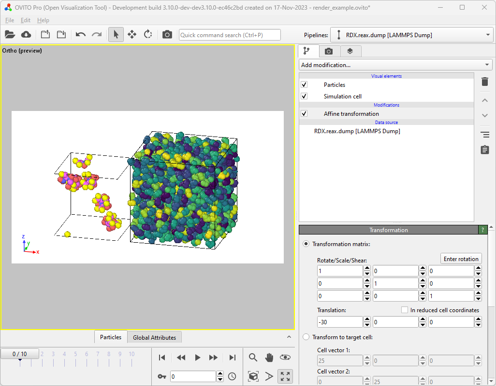
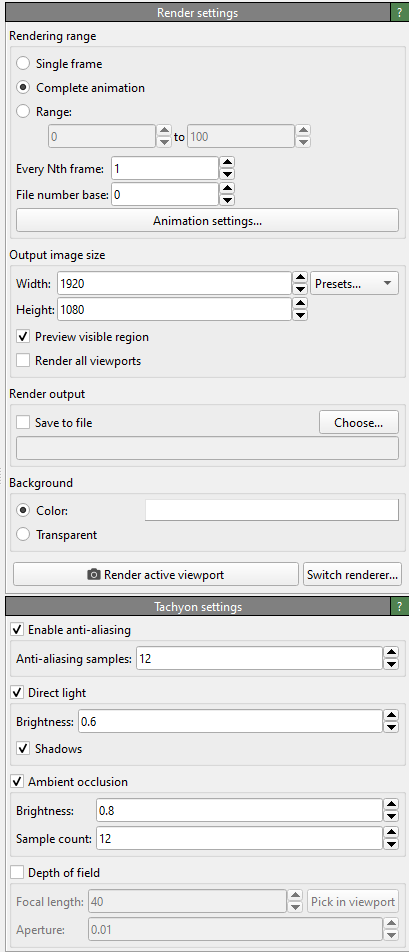
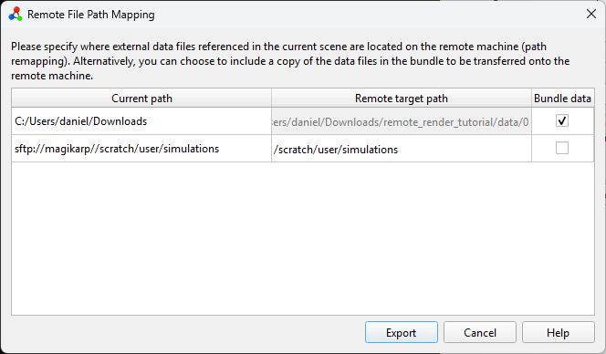

.. _tutorials.remote_rendering:
.. _howto.remote_rendering:

Remote rendering tutorial
=========================

Introduction
------------

In this tutorial, we will demonstrate how to render a video from multiple sources
on a remote high-performance compute cluster. Additional information can be
found in the corresponding :ref:`usage.remote_rendering` manual page.
By leveraging the massively parallel infrastructure, we can significantly
accelerate the rendering process.

OVITO will prepare a bundle locally, which can then be transferred to the
cluster. It's crucial that all structure files included in the scene are
accessible on the remote machine. There are two mechanisms to control this: the
user can either specify the file paths on the remote machine or opt to copy the
required files into the bundle.

This tutorial will cover both methods. Please note that this tutorial is written
with Windows as the local operating system and Linux on the remote compute
cluster. Consequently, paths and (PowerShell) commands may appear unfamiliar,
but similar commands should exist on other major operating systems.

Local setup
-----------

To follow this tutorial, you will need two example time series, which can be
downloaded from the OVITO git repository:
`RDX.reax.dump <https://gitlab.com/stuko/ovito/-/raw/v3.9.2/tests/files/LAMMPS/RDX.reax.dump?ref_type=tags&inline=false>`__,
and
`water.unwrapped.lammpstrj.gz
<https://gitlab.com/stuko/ovito/-/raw/master/tests/files/LAMMPS/water.unwrapped.lammpstrj.gz?ref_type=heads&inline=false>`__.

Place the first file, ``RDX.reax.dump``, in a local directory. Within this
tutorial, the local path will be ``C:\Users\daniel\Downloads\RDX.reax.dump``.
This represents the common scenario where a simulation was performed on a remote
cluster and subsequently all results have been downloaded to the local file
system.

The second file, ``water.unwrapped.lammpstrj.gz``, will represent the case where
you ran a simulation on a remote HPC cluster and wish to process it without
downloading all the files to your local file system. We will use OVITO Pro's
built-in SSH client to access this file remotely. In this example, this file is
located at ``/scratch/daniel/simulations/water.unwrapped.lammpstrj.gz`` on a
compute cluster named ``magikarp``.

First, we set up the scene we want to render on the local computer. Begin by
opening the local ``RDX.reax.dump`` file and translating it by -30 angstroms in
the x-direction (to prevent overlap with the second example file) using the
:ref:`particles.modifiers.affine_transformation` modifier.

Next, use OVITO Pro's :ref:`Load remote file <usage.import.remote>`
functionality with the remote path
``sftp://magikarp//scratch/daniel/simulations/water.unwrapped.lammpstrj.gz``. In
the import file prompt, select :ref:`Add to scene <usage.import.multiple_datasets>`
to load the second data set into the scene.

At this point, both samples should be visible side-by-side in the viewport.
Next, apply any desired modifiers. For this tutorial, we will color the water
molecules by their molecule identifier using the
:ref:`particles.modifiers.color_coding` modifier. This is also the time to configure
viewport overlays, camera angles, and other settings required for your render.

Finally, go to the render tab and configure its settings. Since remote rendering
makes most sense  when rendering multiple images, we will select
:guilabel:`Complete animation` to render the full sequence. There is no need to
check :guilabel:`Save to file`
as this option is handled automatically during the remote rendering process.
Change the renderer from :ref:`OpenGL <rendering.opengl_renderer>` (the default)
to :ref:`Tachyon <rendering.tachyon_renderer>`,
:ref:`OSPRay <rendering.ospray_renderer>`, or :ref:`VisRTX <rendering.visrtx_renderer>`.
This step is necessary because most compute clusters do not provide
the required OpenGL libraries, and some compatibility testing might be required.

After configuring everything as we would for a local rendering instead of
hitting :guilabel:`Render active viewport` and walking away to grab some coffee, we will
instead go to :menuselection:`File --> Render on remote computer...`. This
opens the :menuselection:`Remote render settings` dialog window.

You'll be presented with a table containing three columns (*Current path*,
*Remote target path*, and *Bundle data*), with two rows for each file path used in
the scene. ``C:\Users\daniel\Downloads\`` indicates a local file, while
``sftp://magikarp//scratch/daniel/simulations/`` refers to a remote file path.

Since we do not want to copy them to the server manually we can click the
*Bundle data* checkbox for the local files located at
``C:\Users\daniel\Downloads\``. This disables the *Remote target path*
field and instructs OVITO to copy all files used in the current scene that are
located in ``C:\Users\daniel\Downloads\`` to the bundle directory.

The second file ``water.unwrapped.lammpstrj.gz``, which was loaded from a remote
path is already located on the remote machine. Therefore, we only need to change
the path from ``sftp://magikarp/scratch/daniel/simulations/`` to
``/scratch/daniel/simulations/``. This informs OVITO that all files found at the
original location will be available at the new path once the bundle is moved to
the remote computer. Ensure the remote path is correct.

Set the number of cores per rendering task. By default, this is set to *all available*,
but you may want to adjust it based on your needs. For example, on a
compute node with 96 cores, setting *Cores per task* to 8 means that each node
will spawn 12 workers, rendering 12 images concurrently. Generally, more workers
with fewer cores scale better for most rendering tasks, but some benchmarking
might be required for optimal performance.

Lastly, define a directory for the remote bundle, selected using
the :guilabel:`Choose...` button. In this case, it's ``C:\Users\daniel\Downloads\remote_render_tutorial``.
The selected directory must be empty. Once everything is set up, hit
:guilabel:`Export` to write the actual file bundle.

Pack and transfer
-----------------

After exporting the bundle directory from OVITO Pro, you can (optionally) save
the OVITO state and close it. Checking the bundle directory we can find multiple
files created by OVITO Pro:

.. code-block::

    PS C:\Users\daniel\Downloads> tree /f .\remote_render_tutorial\
    C:\USERS\DANIEL\DOWNLOADS\REMOTE_RENDER_TUTORIAL
    │   config.json
    │   remote_render_ovito.yml
    │   remote_render_task.py
    │   remote_render_state.ovito
    │   submit.sh.template
    └───data
        └─── 0
             └─── RDX.reax.dump

Next, transfer the bundle directory to the HPC cluster. Pack the bundle
directory into a single zip file and transfer it to the remote machine:

.. code-block::

    PS C:\Users\daniel\Downloads> Compress-Archive .\remote_render_tutorial\ .\remote_render_tutorial.zip
    PS C:\Users\daniel\Downloads> scp .\remote_render_tutorial.zip magikarp:/scratch/daniel/render
    remote_render_tutorial.zip                                                            100%   29KB  14.6MB/s   00:00

Rendering on the remote machine
-------------------------------

SSH into the remote machine, unpack the zip archive, and navigate to the bundle directory:

.. code-block:: bash

    daniel@charizard:~$ ssh magikarp
    daniel@magikarp:/scratch/daniel/render$ ls remote_render_tutorial.zip
    daniel@magikarp:/scratch/daniel/render$ unzip remote_render_tutorial.zip
        ...
    daniel@magikarp:/scratch/daniel/render$ cd remote_render_tutorial/
    daniel@magikarp:/scratch/daniel/render/remote_render_tutorial$

Set up the conda environment. This is done using the ``remote_render_ovito.yml``
file. Depending on your local infrastructure, you might need to load modules to
make the correct Python and conda versions available. Here we can run conda
straight from the path. This will create a new conda environment called
*remote_render_ovito* which contains all Python packages required.

.. code-block:: bash

    daniel@magikarp:/scratch/daniel/render/remote_render_tutorial$ conda env create -f remote_render_ovito.yml
        ...
    daniel@magikarp:/scratch/daniel/render/remote_render_tutorial$ conda activate ovito

OVITO Pro has generated a `slurm <https://slurm.schedmd.com/quickstart.html>`__
batch job script template, ``submit.sh.template``,
which you can modify to fit your cluster's job submission system. You might need
to adjust job constraints like walltime, partition, or others. Submit the
rendering task to your cluster's job manager. Remember to load any modules
required by your infrastructure. In our example the ``submit.sh.template`` file
looks like this:

.. code-block:: bash

    #!/bin/bash
    #SBATCH -N 1
    #SBATCH -C cpu
    #SBATCH -q short
    #SBATCH -J render_remote_animation
    #SBATCH -t 00:30:00

    #Conda settings:
        conda activate remote_render_ovito
        export CONDA_LD_LIBRARY_PATH=${CONDA_PREFIX}/x86_64-conda-linux-gnu/sysroot/usr/lib
        export LD_LIBRARY_PATH=${CONDA_LD_LIBRARY_PATH}:${LD_LIBRARY_PATH}

    #Run render
        cd $SLURM_SUBMIT_DIR
        srun -N ${SLURM_NNODES} -n ${SLURM_NNODES} --cpu_bind=none flux start python remote_render_task.py

Once this file is set up we can rename and submit it to the queing system.

.. code-block:: bash

    daniel@magikarp:/scratch/daniel/render/remote_render_tutorial$ submit.sh.template submit.sh
    daniel@magikarp:/scratch/daniel/render/remote_render_tutorial$ sbatch submit.sh

Monitor the job's progress using your cluster's job management tools. When the
rendering is complete, the final images and video will be stored in the bundle
directory:

.. code-block:: bash

    (remote_render_ovito) daniel@magikarp:/scratch/daniel/render/remote_render_tutorial$ tree .
    .
    ├── config.json
    ├── data
    │   └── 0
    │       └── RDX.reax.dump
    ├── frames
    │   ├── frame_0.png
    │   ├── frame_10.png
    │   ├── frame_1.png
    │   ├── frame_2.png
    │   ├── frame_3.png
    │   ├── frame_4.png
    │   ├── frame_5.png
    │   ├── frame_6.png
    │   ├── frame_7.png
    │   ├── frame_8.png
    │   └── frame_9.png
    ├── remote_render_ovito.yml
    ├── remote_render_state.ovito
    ├── remote_render_task.py
    ├── submit.sh
    └── video.mp4

Conclusion
------------

In this tutorial, we walked through the process of setting up a scene in OVITO
Pro, exporting it for remote rendering, transferring the necessary files to an
HPC cluster, setting up the rendering environment, submitting the job, and
retrieving the final results. By leveraging the power of remote high-performance
computing, you can significantly accelerate your rendering tasks.
